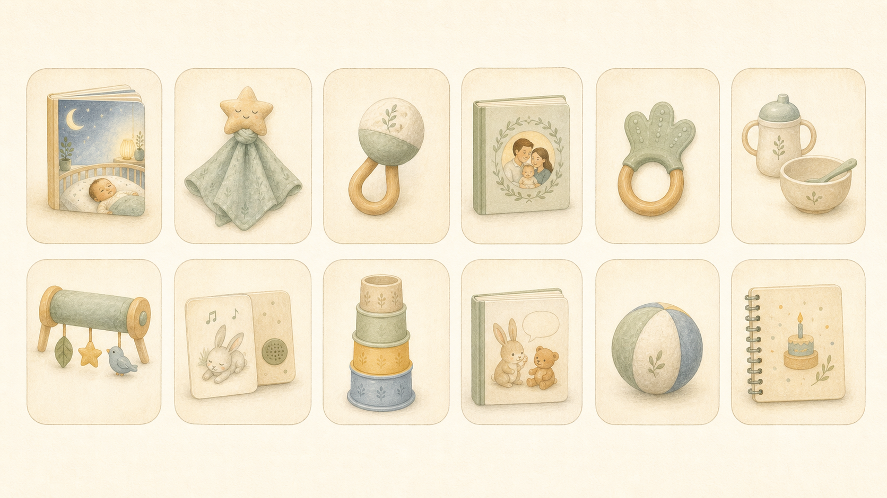

# 12-Month Product Map

Updated: 2026-06-16

## Pricing Baseline

Planning price for the core subscription: **299 SEK/month**.

Target contribution after product, packaging and fulfillment: **120-165 SEK/month** before paid media, app costs and overhead.

## Visual Roadmap

## Month-by-Month Plan

| Month | Box Theme | Physical Product | App Link | Personalization | Est. COGS | Packaging + Fulfillment | Gross Margin At 299 SEK |
|---:|---|---|---|---|---:|---:|---:|
| 1 | First bedtime | Personalized board book | Baby profile, bedtime routine | Name, birth date, avatar basics | 78 SEK | 42 SEK | 60% |
| 2 | Comfort object | Snutte/favorite animal | Choose animal and name it | Animal, color palette | 72 SEK | 42 SEK | 62% |
| 3 | First senses | Soft sensory rattle | Motor and sensory guide | Color family | 68 SEK | 42 SEK | 63% |
| 4 | Family world | Personalized family book | Add family members | Parent names/roles, family look | 82 SEK | 42 SEK | 59% |
| 5 | Grab and explore | Teether/grip toy | Grip and mouth exploration | Color, material preference | 64 SEK | 42 SEK | 65% |
| 6 | Taste starts | Feeding starter item | Food intro tracker | Name on card, feeding notes | 74 SEK | 46 SEK | 60% |
| 7 | Tummy time | Soft activity panel | Play prompts | Favorite animal motif | 80 SEK | 46 SEK | 58% |
| 8 | Sounds and songs | Song/rhyme cards + shaker | Favorite songs library | Favorite song/rhyme | 62 SEK | 42 SEK | 65% |
| 9 | Stack and sort | Stacking cups or soft blocks | Object permanence play | Color set | 78 SEK | 48 SEK | 58% |
| 10 | First words | Personalized first-words mini book | Word tracker | Family objects, pet/sibling | 82 SEK | 42 SEK | 59% |
| 11 | Move and roll | Soft ball/crawling toy | Movement prompts | Color and pattern | 70 SEK | 46 SEK | 61% |
| 12 | First birthday | Birthday memory book + milestone cards | Year summary | Photos, milestones, name | 92 SEK | 48 SEK | 53% |

## Product Principles

- Each month must map to a real parent need: sleep, comfort, feeding, play, language or memory.
- Personalization should increase over time as the app learns more.
- Avoid high-complexity SKUs before retention is proven.
- Every product needs a safety gate before supplier commitment.
- The first three months should be excellent before the full year is scaled.

## First Supplier Briefs To Request

1. Board book printer with variable cover/interior options.
2. Certified baby textile supplier for snutte and soft goods.
3. 0-36 month toy supplier with existing test documentation.
4. Packaging supplier for letterbox-friendly and small parcel formats.

## Key Risks

- COGS creep from over-personalization.
- Too many variants too early.
- Testing/compliance delays.
- Low month 2 retention if the first box feels like a one-off gift rather than a journey.

## Recommended MVP Scope

Launch with months 1-3 production-ready and months 4-12 shown as an upcoming journey.

The first MVP does not need every month finalized. It does need the promise to feel coherent.

